## 📦 Analysis-of-sales-and-profits-by-product-categories-in-the-E-commerce-sector

#### 🧾 Dataset used: Online Retail from Kaggle.

#### 📊 Objective
##### Understand which product categories bring the greatest profit, what the sales dynamics are and how they change depending on the season.
---

#### 🔧 Tools & Technologies
- Python (Pandas, Numpy, Matplotlib, Seaborn)
- STL, SARIMAX, Prophet, statsmodels.api
- Jupyter Notebook
---

#### 🔍 Key Insights
- Total revenue for the period: 3.97M.
- Categories A & B generate 47.3% of revenue.
- The UK remains the leading market.
- Q4 has the strongest seasonal effect.
- Discounted products show higher unit volumes and total sales.
- Category C, despite generating 52.7% of total sales, has relatively low profitability.
- Emerging sales growth is observed in Germany, France, and EIRE.
---

#### 📈 Recommendations
- Re-evaluate Category C.
- Phase out or reposition low-margin products with weak performance.
- Implement targeted discounting for fast-moving or seasonal products.
- Avoid blanket discounting — instead.
- Use discounts tactically during low-season months.
- Launch category-focused campaigns in emerging markets.
- Use seasonal insights to adjust inventory levels in advance of Q4 demand surges.
- Introduce dynamic restocking models based on product velocity and regional demand trends.
- Collect additional data from low-performing markets to understand demand patterns and identify untapped opportunities.
---

#### 📷 Visualizations

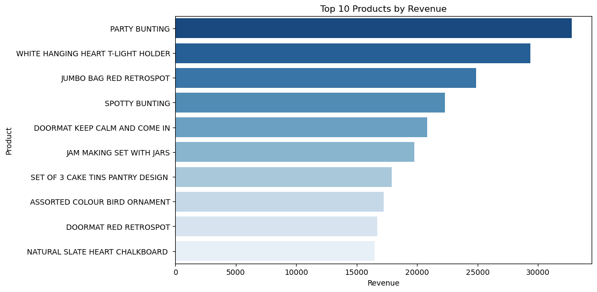
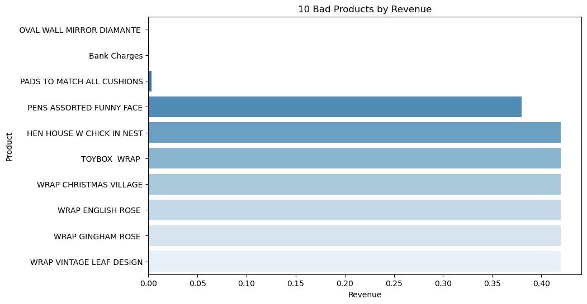
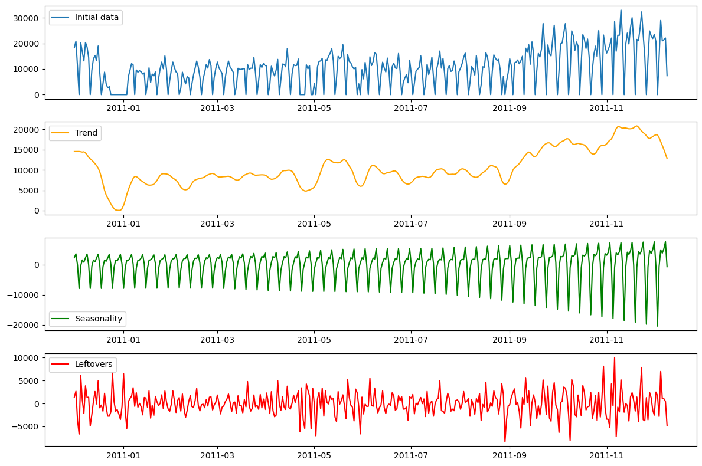
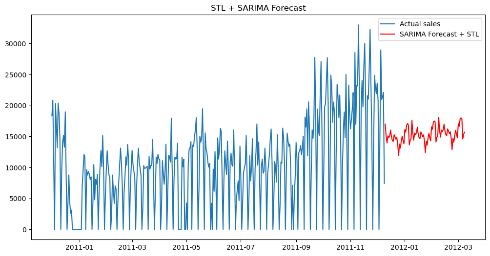
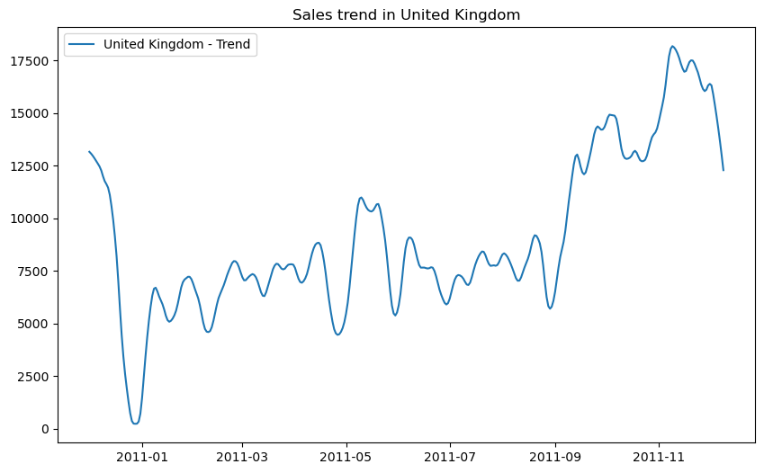
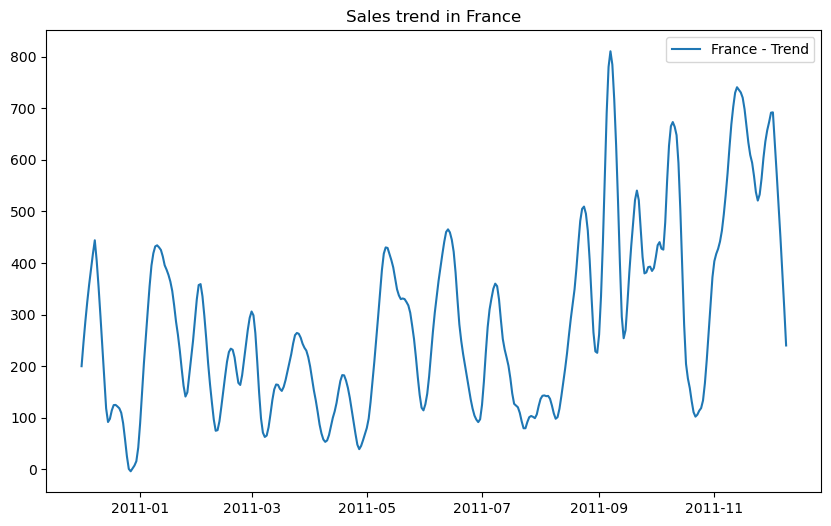
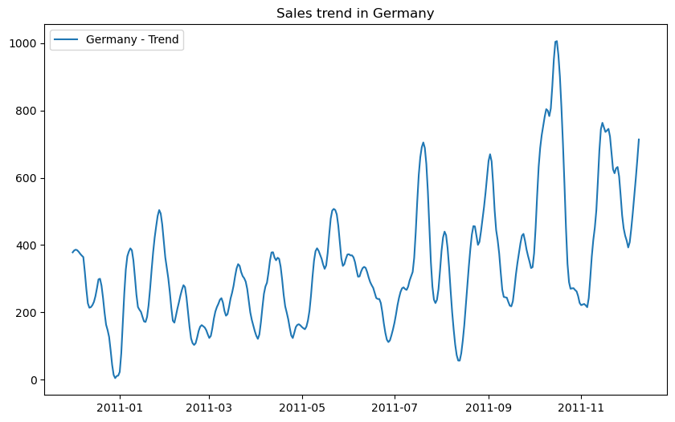
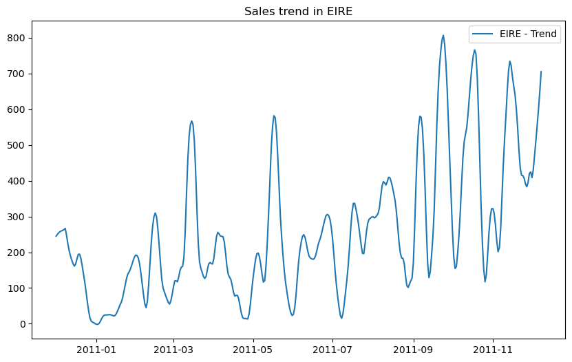
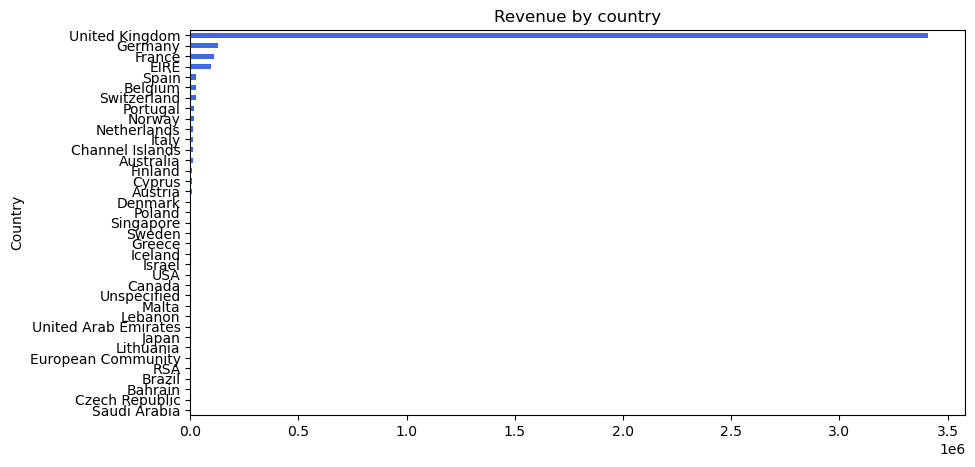
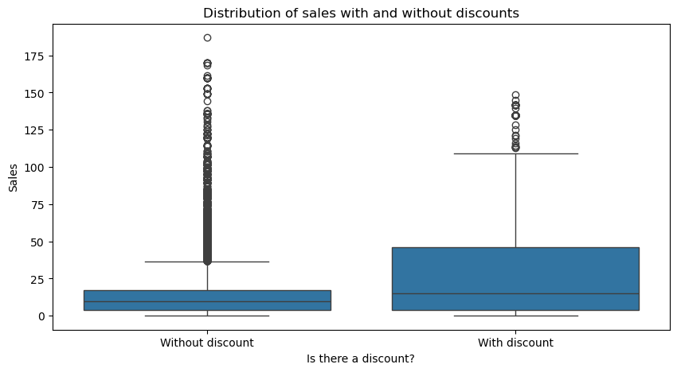
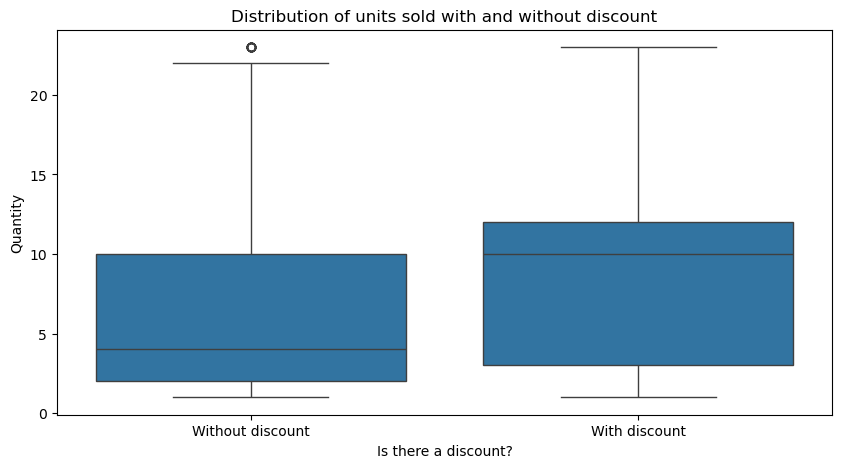
.png)

## 📄 License
This project is licensed under the MIT License. See the [LICENSE](./LICENSE) file for details.
